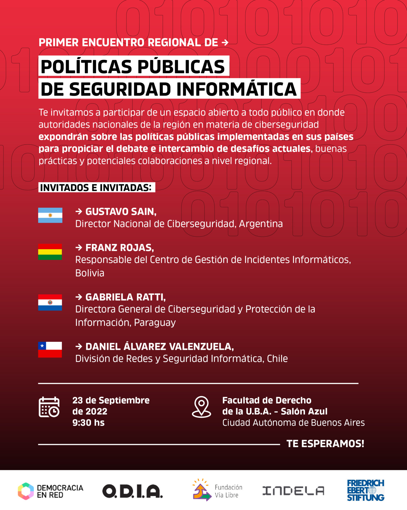

El Encuentro tuvo como objetivo generar un espacio para que autoridades nacionales de la región en materia de seguridad informática puedan exponer experiencias sobre las políticas públicas implementadas en sus países. Asimismo, buscó propiciar el debate e intercambio de desafíos actuales, buenas prácticas y potenciales colaboraciones a nivel regional en esta temática, de crucial importancia y renovada actualidad.

Tuvo lugar el viernes 23 de septiembre desde las 9.30 en el Salón Azul de la Facultad de Derecho (Av. Pres. Figueroa Alcorta 2263, CABA).

Expusieron:

- Gustavo Sain -- Director Nacional de Ciberseguridad, Argentina
- Franz Rojas -- Responsable del Centro de Gestión de Incidentes Informáticos, Bolivia
- Gabriela Ratti, Directora de Ciberseguridad y Protección de la Información, Paraguay
- Daniel Álvarez Valenzuela -- Coordinador Nacional de Ciberseguridad, Chile
- Gaspar Pisanu -- AccessNow
- María Trevisani Vespa -- Observatorio de Derecho Informático Argentino
- Beatriz Busaniche -- Fundación Vía Libre
- Tomás Pomar -- Observatorio de Derecho Informático Argentino
- Agustin Frizzera -- Democracia en Red

Organizan Observatorio de Derecho Informático Argentino -- O.D.I.A., Democracia en Red y [Fundación Vía Libre](https://www.vialibre.org.ar/agenda/primer-encuentro-regional-de-politicas-publicas-de-seguridad-informatica/) con el apoyo Indela y Friedrich Ebert Stiftung MENA.

